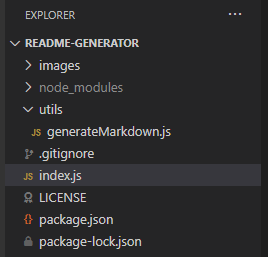
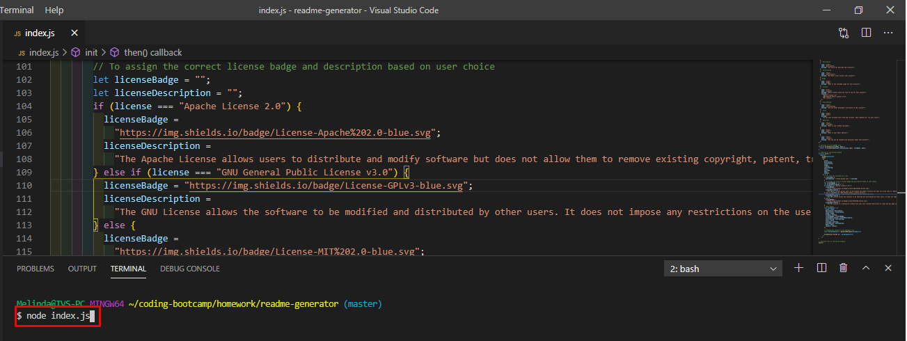
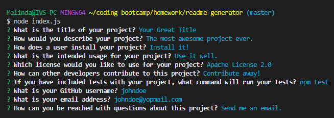

# Professional README Generator 

## Description

I have created a command line program that will help users effortlessly make a professional README for their projects. It uses JavaScript and node.js. Please find the link to a video demonstration below.

<https://melindawinter.github.io/readme-generator/>

## Table of Contents

- [Installation](#installation)
- [Usage](#usage)
- [License](#license)
- [Contributing](#contributing)
- [Tests](#tests)
- [Questions](#questions)

## Installation

If you would like to use this generator, please clone my project. Make sure you have node.js installed on your computer. You can find the download here <https://nodejs.org/en/download/>.

## Usage

Once you have a cloned version, open it up in VS Code or another editor.

Open up your terminal and make sure you are in the correct directory folder. Type "node index.js" into the command line and press Enter.

Type in an answer or use the arrow keys to choose from a drop-down.

When you have answered all the questions, a formatted README file will be generated for you. With the exception of the images, I made this readme with the generator.

## License

GNU General Public License v3.0

The GNU License allows the software to be modified and distributed by other users. It does not impose any restrictions on the use of the software but requires that it remain open source.

## Contributing

Please contribute to this project if you feel that you can make the code more efficient or if you'd like to add more questions for the user. Create your own branch from the Master and submit a pull request. I ask that you follow the Contributor Covenant code of conduct: <https://www.contributor-covenant.org/version/2/0/code_of_conduct/code_of_conduct.md> 

## Tests

There are no tests at this time. If you feel that adding some would improve the project, please follow the instructions above for contributing.

## Questions

- [Github Profile](https://github.com/melindawinter)
- melindawinter42@gmail.com
- You can easily reach me by email or you can find me on LinkedIn here <http://www.linkedin.com/in/melinda-winter-34a25689>.
